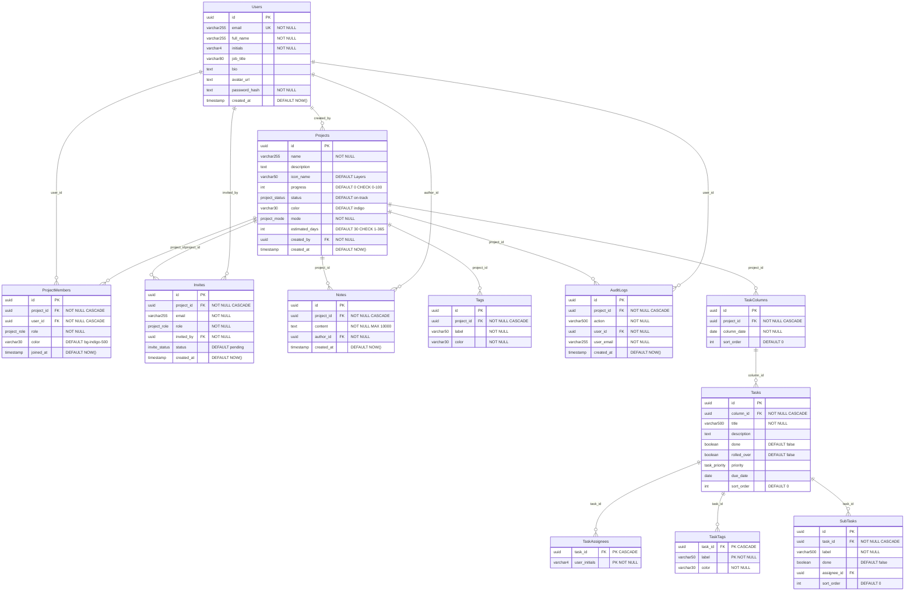

# STRIDE — Backend Requirements Specification

> **Document Version**: 2.0.0  
> **Status**: Ready for Implementation  
> **Frontend Version**: 1.2.0  
> **Last Updated**: February 2026  
> **Audience**: Senior Backend Engineering Team  
> **Companion Document**: `PRD.md`

---

## Table of Contents

1. [Overview](#1-overview)
2. [Frontend Integration Point](#2-frontend-integration-point)
3. [Database Schema & ERD](#3-database-schema--erd)
4. [REST API Specification](#4-rest-api-specification)
5. [Authentication & Authorisation](#5-authentication--authorisation)
6. [Role-Based Access Control (RBAC)](#6-role-based-access-control-rbac)
7. [Data Integrity & Validation](#7-data-integrity--validation)
8. [WebSocket / Real-Time Events](#8-websocket--real-time-events)
9. [Security Hardening](#9-security-hardening)
10. [Deployment Checklist](#10-deployment-checklist)

---

## 1. Overview

STRIDE's frontend is a React 18 SPA that currently runs **entirely offline** using `localStorage`. All data mutations flow through an **async Service Layer** (`src/api/projectService.ts`) that returns Promises. Each function contains a `// Future:` comment showing the exact `apiClient` call to activate.

### The Goal

Build a REST API (+ optional WebSocket layer) that the frontend connects to by:

1. Setting `VITE_API_BASE_URL=https://api.stride.app` in `.env`
2. Calling `setAccessToken(jwt)` after login
3. Uncommenting the `// Future:` lines in `projectService.ts`

**No frontend refactoring is needed.** The API contract is already defined.

### Tech Stack Recommendations

| Concern | Recommended | Alternatives |
|---|---|---|
| **Runtime** | Node.js 20+ (Fastify) | Express, .NET 8, Python (FastAPI) |
| **Database** | PostgreSQL 16+ | — |
| **ORM** | Prisma 5 | Drizzle, TypeORM, Knex |
| **Auth** | `jose` (JWT) | `jsonwebtoken`, Passport.js |
| **Validation** | Zod 3 (strict mode) | Joi, Yup |
| **Real-Time** | Socket.io or `ws` | SSE, Mercure |
| **Hosting** | Docker → AWS ECS / GCP Cloud Run | Railway, Render, Fly.io |

---

## 2. Frontend Integration Point

### Frontend Routing Contract

The SPA frontend uses React Router 6 with the following route map. The backend must be aware of these routes for:
- Correct redirect targets after authentication
- SPA fallback configuration (all non-API routes should serve `index.html`)

| Route | Auth Required | Description |
|---|:---:|---|
| `/` | No | Public Landing Page — no forced redirect for authenticated users |
| `/auth` | No | Login / Register — frontend redirects to `/home` if session exists |
| `/home` | Yes | User Home command center (greeting, quick actions, overview) |
| `/dashboard` | Yes | Project Dashboard — full workspace |
| `/profile` | Yes | User profile |
| `/analytics` | Yes | Analytics |
| `/team` | Yes | Team overview |

**Backend implications:**
- After successful `POST /api/auth/login` or `POST /api/auth/register`, the backend returns a JWT. The frontend then navigates to `/home`.
- The backend must NOT issue HTTP redirects to `/dashboard` — the frontend handles all routing.
- SPA hosting must serve `index.html` for all non-API routes (catch-all fallback).

### API Client (`src/api/apiClient.ts`)

The frontend's Fetch wrapper provides:

| Feature | Detail |
|---|---|
| `Authorization` | `Bearer <token>` injected on every request |
| `Content-Type` | Always `application/json` (forced, not conditional) |
| `X-CSRF-Token` | Read from `<meta name="csrf-token">` and sent on every request |
| `X-Content-Type-Options` | `nosniff` sent as request header |
| `credentials` | `"include"` — sends cookies for session/CSRF |
| `Accept` | `application/json` |
| HTTPS enforcement | Throws at module load if `API_BASE_URL` is not `https://` in production |
| 401 handling | Clears token + fires `onUnauthorized` callback (redirects to `/auth`) |

### Service Layer Endpoint Map (`src/api/projectService.ts`)

| Service Function | Method | Endpoint |
|---|---|---|
| `fetchProjects()` | `GET` | `/api/projects` |
| `createProject(data)` | `POST` | `/api/projects` |
| `updateProject(id, updates)` | `PATCH` | `/api/projects/:id` |
| `deleteProject(id)` | `DELETE` | `/api/projects/:id` |
| `addNote(projectId, ...)` | `POST` | `/api/projects/:projectId/notes` |
| `deleteNote(projectId, noteId)` | `DELETE` | `/api/projects/:projectId/notes/:noteId` |
| `addMember(projectId, member)` | `POST` | `/api/projects/:projectId/members` |
| `removeMember(projectId, memberId)` | `DELETE` | `/api/projects/:projectId/members/:memberId` |
| `updateMemberRole(...)` | `PATCH` | `/api/projects/:projectId/members/:memberId` |
| `sendInvite(projectId, ...)` | `POST` | `/api/projects/:projectId/invites` |
| `acceptInvite(...)` | `POST` | `/api/projects/:projectId/invites/:inviteId/accept` |
| `declineInvite(...)` | `DELETE` | `/api/projects/:projectId/invites/:inviteId` |
| `fetchTasks(projectId)` | `GET` | `/api/projects/:projectId/tasks` |
| `saveTasks(projectId, columns)` | `PUT` | `/api/projects/:projectId/tasks` |

> **Note**: The frontend performs **optimistic updates** — it updates local state immediately, then fires the service call. On error, a toast is shown. A future iteration may add rollback / retry logic.

---

## 3. Database Schema & ERD

### 3.1 Entity-Relationship Diagram (Mermaid)



### 3.2 Enum Definitions

```sql
CREATE TYPE project_status AS ENUM ('on-track', 'delayed', 'completed');
CREATE TYPE project_mode   AS ENUM ('solo', 'team');
CREATE TYPE project_role   AS ENUM ('owner', 'admin', 'editor');
CREATE TYPE invite_status  AS ENUM ('pending', 'accepted', 'declined');
CREATE TYPE task_priority   AS ENUM ('low', 'medium', 'high', 'critical');
```

### 3.3 Unique Constraints & Indexes

```sql
-- A user can only be a member once per project
ALTER TABLE project_members ADD CONSTRAINT uq_project_user
    UNIQUE (project_id, user_id);

-- One column per day per project
ALTER TABLE task_columns ADD CONSTRAINT uq_project_date
    UNIQUE (project_id, column_date);

-- Performance indexes
CREATE INDEX idx_project_members_user ON project_members(user_id);
CREATE INDEX idx_tasks_column ON tasks(column_id);
CREATE INDEX idx_audit_logs_project ON audit_logs(project_id, created_at DESC);
CREATE INDEX idx_invites_email ON invites(email, status);
CREATE INDEX idx_notes_project ON notes(project_id, created_at DESC);
```

### 3.4 Cascade Deletion Rules

All child tables use `ON DELETE CASCADE` on their `project_id` foreign key. When a project is deleted:

- `ProjectMembers` → all membership records
- `Invites` → all pending/historical invites
- `Notes` → all project notes
- `Tags` → all project tags
- `AuditLogs` → all activity trail entries
- `TaskColumns` → all day columns → cascades to `Tasks` → cascades to `TaskAssignees`, `TaskTags`, `SubTasks`

---

## 4. REST API Specification

All endpoints prefixed with `/api`. All request/response bodies are `application/json`.

### 4.1 Authentication

| Method | Endpoint | Description | Auth |
|---|---|---|---|
| `POST` | `/api/auth/register` | Create a new user account | Public |
| `POST` | `/api/auth/login` | Authenticate; returns JWT + sets refresh cookie | Public |
| `POST` | `/api/auth/refresh` | Exchange refresh cookie for new access token | HTTP-Only Cookie |
| `POST` | `/api/auth/logout` | Invalidate refresh token; clear cookie | Bearer |
| `GET` | `/api/auth/me` | Return current user profile | Bearer |
| `PATCH` | `/api/auth/me` | Update profile (fullName, jobTitle, bio, avatarUrl) | Bearer |

**Register Request**:
```json
{
  "fullName": "Alex Kim",
  "jobTitle": "Full-Stack Developer",
  "email": "alex@example.com",
  "password": "SecureP@ss1"
}
```

**Login Response**:
```json
{
  "accessToken": "eyJhbGciOi...",
  "user": {
    "id": "uuid",
    "email": "alex@example.com",
    "fullName": "Alex Kim",
    "initials": "AK",
    "jobTitle": "Full-Stack Developer",
    "avatarUrl": null
  }
}
```

> **Important**: The `refreshToken` is set as an `HttpOnly`, `Secure`, `SameSite=Strict` cookie — **never** included in the JSON response body.

### 4.2 Projects

| Method | Endpoint | Description | Min Role |
|---|---|---|---|
| `GET` | `/api/projects` | List all projects the user is a member of | Any member |
| `POST` | `/api/projects` | Create a new project (caller becomes `owner`) | Authenticated |
| `GET` | `/api/projects/:id` | Get single project with members, tags, notes, audit logs | `editor`+ |
| `PATCH` | `/api/projects/:id` | Update project fields | `editor`+ |
| `DELETE` | `/api/projects/:id` | Delete project and all related data | `owner` only |

**Create Project Body**:
```json
{
  "name": "Design System v3",
  "description": "Rebuilding component library.",
  "iconName": "Palette",
  "progress": 0,
  "status": "on-track",
  "color": "indigo",
  "mode": "team",
  "estimatedDays": 45,
  "members": [
    {
      "initials": "AK",
      "name": "Alex Kim",
      "email": "alex@example.com",
      "color": "bg-indigo-500",
      "role": "owner"
    }
  ],
  "tags": [
    { "label": "Design", "color": "indigo" }
  ]
}
```

**Business Rule — Project Limits** (MUST be enforced server-side):

| Constraint | Limit |
|---|---|
| Total projects per user (Solo + Team combined) | 4 |
| Members per project | 5 |

Return `HTTP 403` with body `{ "error": "PROJECT_LIMIT_REACHED", "message": "Maximum of 4 projects reached." }` when exceeded.

Return `HTTP 403` with body `{ "error": "MEMBER_LIMIT_REACHED", "message": "Maximum of 5 members per project." }` when adding a member beyond the cap.

### 4.3 Project Members

| Method | Endpoint | Description | Min Role |
|---|---|---|---|
| `POST` | `/api/projects/:id/members` | Add a member directly | `admin`+ |
| `PATCH` | `/api/projects/:id/members/:memberId` | Update member's role | `admin`+ |
| `DELETE` | `/api/projects/:id/members/:memberId` | Remove a member | `admin`+ |

> **Business Rule**: The last `owner` cannot be removed. Return `HTTP 409` with `{ "error": "LAST_OWNER", "message": "Cannot remove the last owner." }`.

### 4.4 Invites

| Method | Endpoint | Description | Min Role |
|---|---|---|---|
| `POST` | `/api/projects/:id/invites` | Send an invite (email + role) | `admin`+ |
| `POST` | `/api/projects/:id/invites/:inviteId/accept` | Accept a pending invite | Invite recipient |
| `DELETE` | `/api/projects/:id/invites/:inviteId` | Decline / cancel an invite | Recipient or `admin`+ |

**Send Invite Body**:
```json
{
  "email": "newuser@example.com",
  "role": "editor",
  "invitedBy": "Alex Kim"
}
```

### 4.5 Notes

| Method | Endpoint | Description | Min Role |
|---|---|---|---|
| `POST` | `/api/projects/:id/notes` | Add a note | `editor`+ |
| `DELETE` | `/api/projects/:id/notes/:noteId` | Delete a note | Author or `admin`+ |

**Add Note Body**:
```json
{
  "content": "Finalised the colour tokens — ready for review.",
  "authorName": "Alex Kim",
  "authorInitials": "AK"
}
```

### 4.6 Activity / Audit Logs

| Method | Endpoint | Description | Min Role |
|---|---|---|---|
| `GET` | `/api/projects/:id/activity` | Get paginated audit log | `admin`+ |

**Query Parameters**: `?page=1&limit=50`

**Response**:
```json
{
  "logs": [
    {
      "id": "uuid",
      "action": "Updated project settings",
      "userEmail": "alex@example.com",
      "timestamp": "2026-02-16T14:30:00.000Z"
    }
  ],
  "total": 128,
  "page": 1,
  "limit": 50
}
```

> **Note**: Audit log entries are **created server-side** on every write operation. The frontend's auto-logging is client-side only and should be treated as optimistic. The backend is the source of truth.

### 4.7 Tasks (Weekly Board)

The frontend sends the **entire day-column structure** as a single payload. This simplifies drag-and-drop reordering and eliminates race conditions.

| Method | Endpoint | Description | Min Role |
|---|---|---|---|
| `GET` | `/api/projects/:id/tasks` | Fetch all task columns for the project | `editor`+ |
| `PUT` | `/api/projects/:id/tasks` | Replace all task columns (full overwrite) | `editor`+ |

**PUT Body** (array of day columns):
```json
[
  {
    "date": "2026-02-16T00:00:00.000Z",
    "tasks": [
      {
        "id": "task-a1b2c3d4",
        "title": "Implement login flow",
        "description": "OAuth2 + email/password",
        "tags": [{ "label": "Auth", "color": "rose" }],
        "assignees": ["AK", "MJ"],
        "done": false,
        "rolledOver": false,
        "priority": "high",
        "dueDate": "2026-02-18T00:00:00.000Z"
      }
    ]
  }
]
```

### 4.8 Error Response Format

All errors follow a consistent structure:

```json
{
  "error": "VALIDATION_FAILED",
  "message": "Human-readable description",
  "details": [
    { "field": "name", "message": "Name is required" }
  ]
}
```

| HTTP Code | Usage |
|---|---|
| `400` | Validation error, malformed request |
| `401` | Missing or expired access token |
| `403` | Insufficient role / project limit reached |
| `404` | Resource not found |
| `409` | Conflict (e.g., last owner removal, duplicate member) |
| `429` | Rate limit exceeded |
| `500` | Internal server error |

---

## 5. Authentication & Authorisation

### JWT Strategy

| Token | Lifetime | Storage | Transport |
|---|---|---|---|
| **Access Token** | 15 minutes | In-memory (`setAccessToken()`) | `Authorization: Bearer <token>` |
| **Refresh Token** | 7 days | `HttpOnly`, `Secure`, `SameSite=Strict` cookie | Automatic via `credentials: "include"` |

### Access Token Payload

```json
{
  "sub": "user-uuid",
  "email": "alex@example.com",
  "fullName": "Alex Kim",
  "initials": "AK",
  "iat": 1739712000,
  "exp": 1739712900
}
```

### Cookie Configuration

```
Set-Cookie: stride_refresh=<token>;
  HttpOnly;
  Secure;
  SameSite=Strict;
  Path=/api/auth/refresh;
  Max-Age=604800
```

### CSRF Protection

The backend must:

1. Generate a CSRF token per session and embed it in a `<meta name="csrf-token">` tag (served via the HTML shell or an API endpoint).
2. Validate the `X-CSRF-Token` header on every state-changing request (`POST`, `PUT`, `PATCH`, `DELETE`).
3. Return `403` if the token is missing or invalid.

The frontend already reads this meta tag and sends `X-CSRF-Token` on every request.

### Frontend Expectations

| Scenario | Frontend Behaviour |
|---|---|
| `401 Unauthorized` | Clears access token → redirects to `/auth` (login page) |
| `403 Forbidden` | Shows inline error toast (no redirect) |
| Token refresh | Not yet implemented; backend should support `POST /api/auth/refresh` → new access token |

---

## 6. Role-Based Access Control (RBAC)

### Permission Matrix

| Action | `owner` | `admin` | `editor` |
|---|:---:|:---:|:---:|
| View project & assigned tasks | ✅ | ✅ | ✅ |
| Toggle task status (done/undone) | ✅ | ✅ | ✅ |
| Create / edit / delete **any** task | ✅ | ✅ | ❌ |
| Add / edit / delete notes | ✅ | ✅ | ❌ |
| Add / remove members | ✅ | ✅ | ❌ |
| Change member roles | ✅ | ✅ | ❌ |
| Send / manage invites | ✅ | ✅ | ❌ |
| Edit project settings | ✅ | ✅ | ❌ |
| View Activity Log | ✅ | ✅ | ❌ |
| Delete project | ✅ | ❌ | ❌ |
| Transfer ownership | ✅ | ❌ | ❌ |

> **Editor restrictions:** Editors can only see tasks assigned to them. They can toggle task status (done/undone) but cannot edit task details, change tags, reassign, delete tasks, drag-and-drop, or create new tasks.

### Implementation Pattern

```typescript
// Middleware: extractRole(req, res, next)
// 1. Decode JWT → get user_id
// 2. Query ProjectMembers WHERE project_id = req.params.id AND user_id
// 3. Inject req.projectRole = member.role
// 4. If no membership record → 403

// Guard: requireRole("editor")
const ROLE_HIERARCHY: Record<string, number> = {
  owner: 3, admin: 2, editor: 1
};

function requireRole(minRole: ProjectRole) {
  return (req, res, next) => {
    if (ROLE_HIERARCHY[req.projectRole] < ROLE_HIERARCHY[minRole]) {
      return res.status(403).json({
        error: "INSUFFICIENT_ROLE",
        message: `Requires ${minRole} or higher.`
      });
    }
    next();
  };
}
```

### Key Business Rules

- Every project **must** have at least one `owner`.
- The last `owner` **cannot** be removed or downgraded — return `409`.
- Solo-mode projects still have a single `owner` member record — no special-casing needed.
- An `editor` can only modify tasks **assigned to them** (the `assignees` array contains their initials). Admins and owners can modify all tasks.

---

## 7. Data Integrity & Validation

### Payload Validation Strategy

**ALL request bodies MUST be validated with `.strict()` Zod schemas.** The `.strict()` modifier rejects any undocumented keys, preventing prototype pollution and obfuscated-field injection attacks.

### Zod Schemas

```typescript
import { z } from "zod";

// ── Auth ────────────────────────────────────────────
export const RegisterSchema = z.object({
  fullName: z.string().trim().min(1).max(100)
    .regex(/^[a-zA-Z\s'-]+$/, "Name contains invalid characters"),
  jobTitle: z.string().trim().min(1).max(80),
  email: z.string().trim().email().max(255),
  password: z.string().min(8).max(128)
    .regex(/[A-Z]/, "Must contain an uppercase letter")
    .regex(/[0-9]/, "Must contain a number"),
}).strict();

export const LoginSchema = z.object({
  email: z.string().trim().email().max(255),
  password: z.string().min(1),
}).strict();

export const UpdateProfileSchema = z.object({
  fullName: z.string().trim().min(1).max(100).optional(),
  jobTitle: z.string().trim().max(80).optional(),
  bio: z.string().max(1000).optional(),
  avatarUrl: z.string().url().max(2048).nullable().optional(),
}).strict();

// ── Projects ────────────────────────────────────────
export const CreateProjectSchema = z.object({
  name: z.string().min(1).max(255),
  description: z.string().max(5000).optional(),
  iconName: z.string().max(50).default("Layers"),
  progress: z.number().int().min(0).max(100).default(0),
  status: z.enum(["on-track", "delayed", "completed"]),
  color: z.string().max(30).default("indigo"),
  mode: z.enum(["solo", "team"]),
  estimatedDays: z.number().int().min(1).max(365).default(30),
  members: z.array(z.object({
    initials: z.string().max(4),
    name: z.string().max(255),
    email: z.string().email(),
    color: z.string().max(30),
    role: z.enum(["owner", "admin", "editor"]),
  }).strict()).min(1),
  tags: z.array(z.object({
    label: z.string().max(50),
    color: z.string().max(30),
  }).strict()).optional(),
}).strict();

export const UpdateProjectSchema = CreateProjectSchema
  .omit({ members: true, tags: true })
  .partial()
  .strict();

// ── Notes ───────────────────────────────────────────
export const CreateNoteSchema = z.object({
  content: z.string().min(1).max(10000),
  authorName: z.string().max(255),
  authorInitials: z.string().max(4),
}).strict();

// ── Members ─────────────────────────────────────────
export const AddMemberSchema = z.object({
  initials: z.string().max(4),
  name: z.string().max(255),
  email: z.string().email(),
  color: z.string().max(30),
  role: z.enum(["admin", "editor"]),
}).strict();

export const UpdateMemberRoleSchema = z.object({
  role: z.enum(["owner", "admin", "editor"]),
}).strict();

// ── Invites ─────────────────────────────────────────
export const SendInviteSchema = z.object({
  email: z.string().email().max(255),
  role: z.enum(["admin", "editor"]),
  invitedBy: z.string().max(255),
}).strict();

// ── Tasks ───────────────────────────────────────────
const TaskTagSchema = z.object({
  label: z.string().max(50),
  color: z.string().max(30),
}).strict();

const TaskSchema = z.object({
  id: z.string(),
  title: z.string().min(1).max(500),
  description: z.string().max(5000).default(""),
  tags: z.array(TaskTagSchema).default([]),
  assignees: z.array(z.string().max(4)).default([]),
  done: z.boolean().default(false),
  rolledOver: z.boolean().default(false),
  priority: z.enum(["low", "medium", "high", "critical"]).nullable().optional(),
  dueDate: z.string().datetime().nullable().optional(),
}).strict();

const DayColumnSchema = z.object({
  date: z.string().datetime(),
  tasks: z.array(TaskSchema).default([]),
}).strict();

export const SaveTasksSchema = z.array(DayColumnSchema);
```

### Server-Side Sanitisation

**Never trust the client.** Even though the frontend sanitises all inputs, the backend must:

| Requirement | Implementation |
|---|---|
| **HTML/XSS stripping** | Strip `<script>`, `<style>`, all HTML tags, `javascript:` / `data:` URIs, `on*=` handlers |
| **Profanity filter** | Replace matches from server-side word list with asterisks |
| **SQL injection** | Parameterised queries only (Prisma/Drizzle handle this) |
| **UUID validation** | All `:id` params must be valid UUIDs — reject with `400` otherwise |

### Backend-Enforced Project Limits

```typescript
const MAX_TOTAL_PROJECTS = 4;
const MAX_MEMBERS_PER_PROJECT = 5;

async function enforceProjectLimit(userId: string) {
  const count = await db.project.count({
    where: {
      members: { some: { userId } },
    },
  });
  if (count >= MAX_TOTAL_PROJECTS) {
    throw new ApiError(403, "PROJECT_LIMIT_REACHED",
      `Maximum of ${MAX_TOTAL_PROJECTS} projects reached.`);
  }
}

async function enforceMemberLimit(projectId: string) {
  const count = await db.projectMember.count({
    where: { projectId },
  });
  if (count >= MAX_MEMBERS_PER_PROJECT) {
    throw new ApiError(403, "MEMBER_LIMIT_REACHED",
      `Maximum of ${MAX_MEMBERS_PER_PROJECT} members per project.`);
  }
}
```

---

## 8. WebSocket / Real-Time Events

### Connection

```
wss://api.stride.app/ws?token=<accessToken>
```

Authenticate via query param on initial handshake. The server validates the JWT and associates the socket with the user.

### Room Model

Each project is a **room**. When a user selects a project on the frontend, the client joins `project:<projectId>`. The server broadcasts events to all room members except the sender.

### Event Catalogue

| Event Name | Direction | Payload | Trigger |
|---|---|---|---|
| `project:updated` | Server → Client | `{ projectId, fields: Partial<Project> }` | `PATCH /api/projects/:id` |
| `task:board_updated` | Server → Client | `{ projectId, columns: DayColumn[] }` | `PUT /api/projects/:id/tasks` |
| `member:added` | Server → Client | `{ projectId, member: ProjectMember }` | `POST /api/projects/:id/members` |
| `member:removed` | Server → Client | `{ projectId, memberId: string }` | `DELETE /api/projects/:id/members/:id` |
| `member:role_changed` | Server → Client | `{ projectId, memberId, newRole }` | `PATCH /api/projects/:id/members/:id` |
| `invite:sent` | Server → Client | `{ projectId, invite: Invite }` | `POST /api/projects/:id/invites` |
| `invite:accepted` | Server → Client | `{ projectId, inviteId, newMember }` | `POST .../accept` |
| `note:added` | Server → Client | `{ projectId, note: Note }` | `POST /api/projects/:id/notes` |
| `note:deleted` | Server → Client | `{ projectId, noteId: string }` | `DELETE /api/projects/:id/notes/:id` |
| `activity:logged` | Server → Client | `{ projectId, entry: AuditLogEntry }` | Any write operation |
| `presence:join` | Server → Client | `{ projectId, userId, initials }` | User opens project |
| `presence:leave` | Server → Client | `{ projectId, userId }` | User leaves project |
| `presence:heartbeat` | Client → Server | `{ projectId }` | Every 30 seconds |

### Frontend Integration Notes

The current frontend does **not** have a WebSocket client. When ready, add a `wsClient.ts` alongside `apiClient.ts`:

```typescript
// src/api/wsClient.ts
import { getAccessToken } from "./apiClient";

const API_WS_URL = import.meta.env.VITE_API_BASE_URL
  ?.replace("https://", "wss://")
  ?.replace("http://", "ws://");

export function connectWebSocket(onMessage: (type: string, payload: unknown) => void) {
  const ws = new WebSocket(`${API_WS_URL}/ws?token=${getAccessToken()}`);

  ws.addEventListener("message", (event) => {
    const { type, payload } = JSON.parse(event.data);
    onMessage(type, payload);
  });

  return ws;
}
```

---

## 9. Security Hardening

The frontend implements comprehensive security. The backend must match or exceed these measures.

### Frontend Security (Already Implemented)

| Measure | Detail |
|---|---|
| **CSP** | `script-src 'self'` — blocks `unsafe-eval` and `unsafe-inline` |
| **CSRF** | `X-CSRF-Token` header on every state-changing request |
| **Anti-Clickjacking** | CSP `frame-ancestors 'none'` + legacy frame-buster + `X-Frame-Options: DENY` |
| **HTTPS Enforcement** | `API_BASE_URL` must be `https://` in production (runtime check) |
| **MIME Protection** | `X-Content-Type-Options: nosniff` meta tag + request header |
| **Referrer Policy** | `strict-origin-when-cross-origin` |
| **Prototype Pollution** | Allowlisted field sets on all `updateProject` / settings mutations |
| **XSS Sanitisation** | `sanitizeInput()` strips HTML, scripts, event handlers, `javascript:` URIs |
| **Payload Validation** | Zod `.strict()` schemas on auth forms |
| **Console Neutering** | `console.log/info/trace/debug` disabled in production builds |
| **Source Map Stripping** | `build.sourcemap: false`; `esbuild.drop: ["console", "debugger"]` |
| **Supply Chain** | `npm audit` clean; high-severity vulnerabilities patched |
| **`dangerouslySetInnerHTML`** | Single instance audited; sanitised with `SAFE_CSS_VALUE` regex |
| **Self-XSS Warning** | Facebook-style console warning against social engineering |

### Backend Security Requirements

| Measure | Implementation |
|---|---|
| **CORS** | Whitelist `https://stride.app` only; `credentials: true`; no wildcard origins |
| **Rate Limiting** | Auth endpoints: 5 req/min per IP; API: 100 req/min per user |
| **Password Hashing** | bcrypt with cost factor ≥ 12 (or Argon2id) |
| **JWT Signing** | RS256 (asymmetric) preferred; HS256 minimum with 256-bit secret |
| **Refresh Token Rotation** | Issue new refresh token on each `/api/auth/refresh` call; invalidate the old one |
| **CSRF Validation** | Verify `X-CSRF-Token` header on `POST` / `PUT` / `PATCH` / `DELETE` |
| **Content-Type Enforcement** | Reject requests with `Content-Type` other than `application/json` on write endpoints |
| **Security Headers** | `X-Content-Type-Options: nosniff`, `X-Frame-Options: DENY`, `Strict-Transport-Security: max-age=31536000`, `X-XSS-Protection: 0` (CSP supersedes) |
| **SQL Injection** | Parameterised queries only (enforced by ORM) |
| **UUID Validation** | Validate all path/query IDs are valid UUIDs before database lookup |
| **Audit Logging** | Server-side `AuditLogs` entry created on every write mutation |
| **Input Sanitisation** | All string fields sanitised before persistence (HTML strip + profanity filter) |
| **Payload Rejection** | Zod `.strict()` on all request schemas — unknown keys → `400` |
| **Error Masking** | Never expose stack traces, SQL errors, or internal paths in production responses |
| **Dependency Audit** | Automated `npm audit` in CI pipeline; fail build on high-severity issues |

---

## 10. Deployment Checklist

### Frontend Changes (3 steps)

```bash
# 1. Set environment variable
VITE_API_BASE_URL=https://api.stride.app

# 2. After login, store the access token
import { setAccessToken } from "../api/apiClient";
setAccessToken(response.accessToken);

# 3. In projectService.ts — swap localStorage lines for apiClient calls
#    Each function has a "// Future:" comment with the exact one-liner
```

### Backend Infrastructure

| Concern | Specification |
|---|---|
| **Runtime** | Node.js 20 LTS (Fastify 5) |
| **Database** | PostgreSQL 16+ with `uuid-ossp` extension |
| **Migrations** | Prisma Migrate (or Flyway / Knex migrations) |
| **Auth** | JWT via `jose`; bcrypt for password hashing |
| **Validation** | Zod 3 with `.strict()` on all schemas |
| **WebSocket** | `@fastify/websocket` or Socket.io |
| **CORS** | `@fastify/cors` with explicit origin whitelist |
| **Rate Limiting** | `@fastify/rate-limit` |
| **Logging** | Pino (structured JSON logs) |
| **Monitoring** | Health check at `GET /api/health` |
| **Container** | Docker multi-stage build; `distroless` base image |
| **Hosting** | AWS ECS / GCP Cloud Run / Railway |
| **CI/CD** | GitHub Actions → build → test → deploy |
| **Secrets** | Environment variables via cloud provider secrets manager — never in code |

### Health Check Endpoint

```
GET /api/health → 200 { "status": "ok", "version": "1.0.0", "uptime": 3600 }
```

---

<div align="center">
  <sub>This document is the single source of truth for STRIDE backend integration.<br/>
  All API contracts are frozen pending backend review. Keep updated as endpoints evolve.</sub>
</div>
